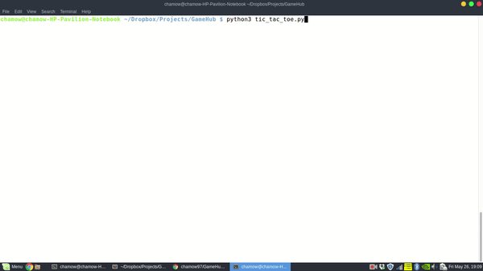
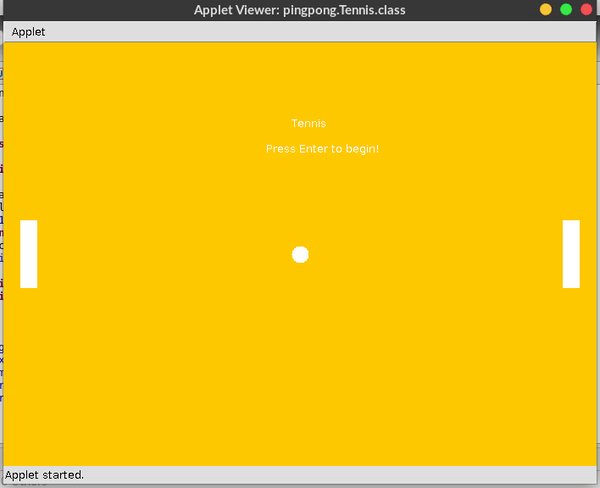

Greate code simple but very Impressive
<h1 style="text-align: center; margin-left: auto; margin-right: auto;"> GAMEHUB </h1>

This repository contains games developed using various Languages like Python and JAVA. Intention of this project is to create games using various technologies

<h3>1. Tic-Tac-Toe - Python 3</h3>
<h4>Instruction</h4>

A two player game which can have from 2x2 to 10x10 matrix.

<h4>How to run the game?</h4>

1. Install python3 either by visiting their official website which can be found <a href="https://www.python.org/downloads/">here</a> or running a command.  <code>sudo apt-get install python3</code>

2. Run the following code to run the game.  <code>python3 tic-tac-toe.py</code>

<h4>Sample gameplay</h4>

<h4>Code Review</h4>

The code has been reviewed at stackexchange which can be found <a href="https://codereview.stackexchange.com/questions/162752/simple-tic-tac-toe-game-in-python3">here</a>.

 
<h3>2. Ping-Pong - Java</h3>
<h4>Instruction</h4>

Ping pong is a Player vs CPU type of classic ping pong game.

<h4>How to run the game?</h4>
<h5>Eclipse IDE</h5>
<ol>
	<li>Install Eclipse IDE and setup Java.</li>
	<li>Copy the file contents to Eclipse Workspace Folder.</li>
	<li>Open the project in Eclipse and run Tennis.java file in the source folder.</li>
</ol>
<h5>Netbeans and other IDE</h5>
<ul>
	<li>Import the project as Eclipse Project in the IDE.</li>
	<li>Follow the above steps.</li>
</ul>
<h4>Sample Gameplay</h4>

